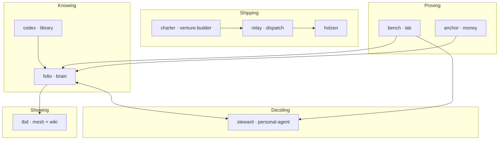

# Projects

**Angel Guirao** — product-minded full-stack engineer building tools for **knowing, deciding, and shipping** without outsourcing judgment to platforms or copilots.

This repository is the **map**: how my projects relate, what each one owns, and where to look first. Nine sibling repos beside this folder — not a monorepo. **Compose mature open source. Own the glue.**

---

## Start here

| | Link | What it is |
|---|------|------------|
| **Mesh** | [angelguirao.com](https://angelguirao.com/) | Felt rooms — problems, identity, projects, connection |
| **Footnotes** | [angelguirao.com/wiki](https://angelguirao.com/wiki) | Concepts from reading, distilled for strangers |
| **Holzen** | [holzen.app](https://holzen.app) | Shipped product — pause before capital moves |

The mesh is how it *feels*. Footnotes are what I *know* in public. Holzen is what I *ship* to users.

---

## The through-line

I read and clip. Ideas compile into a wiki (**folio**). A personal agent (**steward**) routes attention across the day. Selected work becomes exhibition on the mesh (**tbd**). Products that earn users get their own repo (**holzen**). Experiments start in a sandbox (**bench**) and graduate or die. Open source gets composed; the seams between repos are mine.

**Reading in** → **folio** holds what's true enough → **steward** routes the day → **tbd** exhibits what earns visibility → **holzen** (and future ventures) ship to the world. **bench** tries OSS first; **relay** and **charter** connect venture work.

---

## The projects

Product names are what I call them day to day. Folder names are the git repos.

### Knowing

**folio** · `brain/` · *active*  
Markdown wiki for what I read and think — capture, search, compile, publish footnotes when an idea is ready to meet the world.

**codex** · `library/` · *building*  
Home for books and PDFs that feed folio — keep what matters locally, sync the rest into notes.

### Deciding

**steward** · `personal-agent/` · *active*  
Personal agent on OpenClaw — routes attention across memory, reading, and the day without handing life to a work copilot.

### Showing

**tbd** · `tbd/` · *active* · [mesh →](https://angelguirao.com/)  
This exhibition — felt rooms for problems, identity, and connection; the public layer on top of what folio knows.

### Shipping

**holzen** · `holzen/` · *active* · [holzen.app →](https://holzen.app)  
Deliberate friction before capital moves — a ritual that keeps investor decisions human-sized.

**charter** · `venture-builder/` · *building*  
Constitution for side ventures — gates, templates, and rules for what gets built, promoted, or killed.

**relay** · `dispatch/` · *building*  
Background jobs and webhooks for repeatable work — product cycles, agent maintenance, venture ops.

### Proving

**bench** · `lab/` · *active*  
Sandbox for open source — Bitcoin tooling, evals, agents, and upstream trials before they graduate into the stack.

**anchor** · `money/` · *building*  
Self-custody Bitcoin infrastructure — compose, regtest, and runbooks for running my own node.

---

## Connect

- [Mesh](https://angelguirao.com/) · [Footnotes](https://angelguirao.com/wiki) · [Holzen](https://holzen.app)
- [LinkedIn](https://linkedin.com/in/angelguirao) · [GitHub](https://github.com/Angelguirao)
