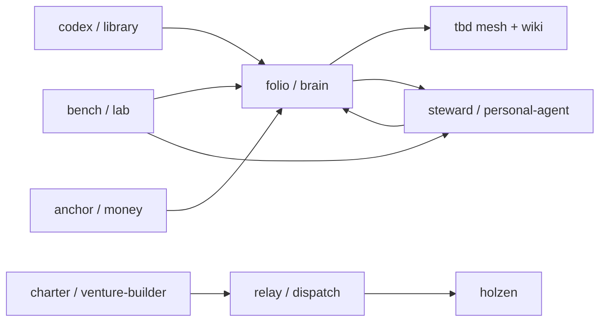

# Stack map

**A multi-repo personal stack for knowing clearly, deciding with judgment intact, and building in public where it earns it.**

Not a monorepo — nine sibling repos, explicit seams, glue you own. This repository is the **map**: architecture, problem framing, and how to clone the workspace. Application code lives in the siblings.

| Surface | Link | What you'll see |
|---------|------|-----------------|
| **Mesh** | [tbd-delta.vercel.app](https://tbd-delta.vercel.app/) | Felt rooms — problems, identity, projects, connection |
| **Footnotes** | [tbd-delta.vercel.app/wiki](https://tbd-delta.vercel.app/wiki) | Readable concepts distilled from reading (Socratic + systems thinking) |
| **Holzen** | [holzen.app](https://holzen.app) | Shipped product — pause-first ritual before capital moves |
| **This repo** | you are here | Stack map, clone guide, vision |

On the mesh: [`/?room=problems`](https://tbd-delta.vercel.app/?room=problems) · [`/?room=projects`](https://tbd-delta.vercel.app/?room=projects)

---

## Thesis

**Compose mature open source. Own the glue.**

- **Problems** (macro) → **projects** (repos) — not a priority ranking; each repo is tagged with the problem(s) it serves.
- **Capture → distill → exhibit** — clips and notes become wiki concepts; some become mesh rooms; agents route attention, they don't replace craft.
- **Private by default, public when earned** — most repos are still private while I work. Holzen is live; footnotes and mesh are public; this map is public so the architecture is legible.

---

## The stack

Product names are what I call them day to day. Folder names are the git repos on disk.

| Name | Repo | Role | Status | Public |
|------|------|------|--------|--------|
| **folio** | [`brain`](https://github.com/Angelguirao/brain) | Second brain — capture, compile, footnotes | active | footnotes only |
| **codex** | [`library`](https://github.com/Angelguirao/library) | Reading — Calibre, books → raw ingest | building | — |
| **tbd** | [`tbd`](https://github.com/Angelguirao/tbd) | Exhibition — this mesh + `/wiki` | active | [mesh](https://tbd-delta.vercel.app/) |
| **steward** | [`personal-agent`](https://github.com/Angelguirao/personal-agent) | Life agent — OpenClaw, memory, routing | active | — |
| **holzen** | [`holzen`](https://github.com/Angelguirao/holzen) | Pause ritual — deliberate friction before money moves | active | [holzen.app](https://holzen.app) |
| **relay** | [`dispatch`](https://github.com/Angelguirao/dispatch) | Automation — webhooks, cycles, background jobs | building | — |
| **charter** | [`venture-builder`](https://github.com/Angelguirao/venture-builder) | Venture rules — gates, templates, what ships | building | repo public |
| **bench** | [`lab`](https://github.com/Angelguirao/lab) | Experiments — OSS trials before they graduate | active | — |
| **anchor** | [`money`](https://github.com/Angelguirao/money) | Bitcoin — compose, regtest, runbooks | building | — |

**Stack plumbing** (no macro-problem tag): **relay**, **charter** — they connect the rest.

---

## Problems → projects

Informed by [80,000 Hours problem profiles](https://80000hours.org/problem-profiles/), but not a ranked hit list. I care holistically; these three are where **open source + code** is my honest lever.

| Problem | Projects |
|---------|----------|
| **Power-seeking AI** | **bench** — evals, monitoring, agent tooling; contribute upstream when maintainers welcome it |
| **Extreme power concentration** | **anchor**, **bench** — inspectable money and comms; compose, don't fork-the-world |
| **AI-enhanced decision making** | **folio**, **codex**, **steward**, **tbd**, **holzen** — tools you own for knowing and deciding without outsourcing judgment |

Start from **why** on the mesh ([problems room](https://tbd-delta.vercel.app/?room=problems)), then **what** ([projects room](https://tbd-delta.vercel.app/?room=projects)).

---

## How it connects



**Creative loop:** capture → **folio** (what's true enough) → **tbd** (how it feels in public) → **steward** routes attention. **bench** proves; siblings keep what ships.

<details>
<summary>Data paths (operator detail)</summary>

```
Calibre → library/ ──sync──► brain/raw/books/
Obsidian / clips ───────────► brain/raw/articles/
brain/wiki/ ──publish──► tbd /wiki
brain/exhibits.yaml ──sync──► tbd mesh rooms
Telegram → OpenClaw → personal-agent/ ──brain skill──► brain
venture-builder/ ──YAML──► dispatch/ ──cycles──► holzen/
money/ compose + runbooks
lab/play ──promote──► brain | tbd | personal-agent | holzen | …
```

</details>

---

## What to read next

| Audience | Start here |
|----------|------------|
| **Visitor** | [Mesh](https://tbd-delta.vercel.app/) → [Footnotes](https://tbd-delta.vercel.app/wiki) → [Holzen](https://holzen.app) |
| **Collaborator** | [Clone the workspace](docs/CLONE-ALL.md) → sibling repo READMEs |
| **Operator / agent** | [brain/BOUNDARIES.md](brain/BOUNDARIES.md) · [docs/VISION.md](docs/VISION.md) |

| Doc | What |
|-----|------|
| [docs/VISION.md](docs/VISION.md) | Constitution — LifeOS pivot, creative loop, anti-patterns |
| [docs/OSS-STRATEGY.md](docs/OSS-STRATEGY.md) | 80k × personal fit × upstream vs build |
| [docs/CLONE-ALL.md](docs/CLONE-ALL.md) | Fresh machine — clone parent + all siblings |
| [LEGACY.md](LEGACY.md) | Prior LifeOS work — mine, don't revive |
| [brain/BOUNDARIES.md](brain/BOUNDARIES.md) | What lives in which repo |

---

## Archive

Not in the active stack — prior ventures kept for history.

| Name | What | When |
|------|------|------|
| **Lawers** | Litigation finance marketplace — Spain's first online litigation-funding platform | 2017–2019 · inactive |

Legacy LifeOS clones: [legacy/](legacy/README.md) — read only.

---

## Quick start (local)

Parent folder holds the meta-repo **and** sibling checkouts side by side ([layout](docs/CLONE-ALL.md)).

| If you want to… | Command |
|-----------------|---------|
| Open the mesh | `cd tbd && npm run dev` → http://localhost:3000 |
| Reading room + compile | `cd brain && npm run ui` · [brain/README.md](brain/README.md) |
| Ship Holzen | `cd holzen && npm run dev` → http://localhost:8080 |
| OSS experiments | `cd lab` → [lab/README.md](lab/README.md) |

---

## About

**Angel Guirao** — product-minded full-stack engineer (Madrid). Law/VC → Webel → shipping Holzen and this stack.

- [Mesh](https://tbd-delta.vercel.app/) · [Footnotes](https://tbd-delta.vercel.app/wiki) · [Holzen](https://holzen.app)
- [LinkedIn](https://linkedin.com/in/angelguirao) · [GitHub](https://github.com/Angelguirao)

---

*Each sibling repo owns its README. This file is the index — update the mesh [projects room](https://tbd-delta.vercel.app/?room=projects) when the stack changes.*
