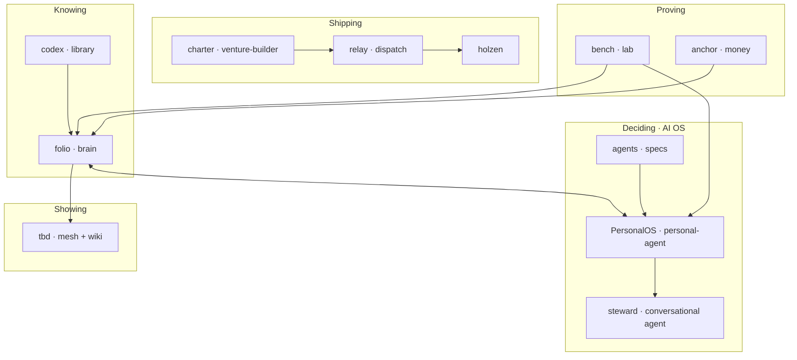

# Projects

**Angel Guirao** — product-minded full-stack engineer building tools for **knowing, deciding, and shipping** without outsourcing judgment to platforms or copilots.

This repository is the **map**: how my projects relate, what each one owns, and where to look first. Ten sibling repos beside this folder — not a monorepo. **Compose mature open source. Own the glue.**

---

## Start here

| | Link | What it is |
|---|------|------------|
| **Mesh** | [angelguirao.com](https://angelguirao.com/) | Felt rooms — problems, identity, projects, connection |
| **Footnotes** | [angelguirao.com/wiki](https://angelguirao.com/wiki) | Concepts from reading, distilled for strangers |
| **Holzen** | [holzen.app](https://holzen.app) | Shipped product — pause before capital moves |
| **AI-Native Product Building** | [handbook](https://ai-native-product-building.vercel.app) | Living handbook — decisions for building with AI |

The mesh is how it *feels*. Footnotes are what I *know* in public. Holzen is what I *ship* to users. The handbook is what I *teach*.

**How code should look from the inside:** holzen’s [application architecture](https://github.com/Angelguirao/holzen/blob/master/docs/fundamentals/holzen-application-architecture.md) is the product reference. Stack constitution and repo seams live in private/local docs (`docs/`, `brain/BOUNDARIES.md`) — not published from this repo.

---

## The through-line

I read and clip. Ideas compile into a wiki (**folio**). **PersonalOS** is my AI personal operating system — steward chat, domain desks, inquiry loops, scheduled agent work, and handoffs in one place. Selected work becomes exhibition on the mesh (**tbd**). Products that earn users get their own repo (**holzen**). Experiments start in a sandbox (**bench**) and graduate or die. Open source gets composed; the seams between repos are mine.

**Reading in** → **folio** holds what's true enough → **PersonalOS** runs the AI stack (steward, desks, loops, specialists) → **tbd** exhibits what earns visibility → **holzen** (and future ventures) ship to the world. **bench** tries OSS first; **relay** and **charter** connect venture work.

---

## The projects

Product names are what I call them day to day. Folder names are the git repos.

### Knowing

**folio** · `brain/` · *active*  
Markdown wiki for what I read and think — capture, search, compile, publish footnotes when an idea is ready to meet the world.

**codex** · `library/` · *building*  
Home for books and PDFs that feed folio — keep what matters locally, sync the rest into notes.

### Deciding · AI operating system

**agents** · `agents/` · *active* · *private repo*  
**Portable AI substrate** — agent specs, handoff contract, rulebook. Pairs with `personal-agent/shared/` (memory tiers, routing). Reusable outside LifeOS; holzen uses patterns, not Angel's folio.

**PersonalOS** · `personal-agent/` · *active* · *private repo* · [os.angelguirao.com/os →](https://os.angelguirao.com/os)  
**AI OS product** — steward chat, desks, inquiry loop, feed, crons, handoffs. Implements the substrate for one principal. Same repo holds LifeOS **instance data** (`openclaw/`). LifeOS = this + brain + ops — a named instance, not the only possible AI OS.

**steward** (Claw) · `agents/specs/steward/` · runtime in PersonalOS  
The one conversational agent inside the OS — inquiry, capture, synthesis.

**vocation-desk** · `vocation-desk/` · *active*  
Career-scout **ops engine** — scan, score, PDF, export. Trigger.dev (VPS parallel) + PersonalOS `/os/career`. No standalone agent UI.

**glucose-rhythm** · `glucose-rhythm/` · *active* · *local git*  
Glucose-manager **ops engine** — TIR rollup, Nightscout pull, export. Trigger.dev (VPS parallel) + PersonalOS `/os/body`. Health data stays gitignored.

### Showing

**tbd** · `tbd/` · *active* · [mesh →](https://angelguirao.com/)  
Public exhibition — mesh rooms and footnotes only. `/os` and `/wiki/inner` redirect to PersonalOS.

**AI-Native Product Building** · `ai-native-product-building/` · *active* · [handbook →](https://ai-native-product-building.vercel.app)  
Living handbook — decision frameworks for building products when AI changes every step. Chapters in MDX; drafts start in brain.

### Shipping

**holzen** · `holzen/` · *active* · [holzen.app →](https://holzen.app)  
Deliberate friction before capital moves — a ritual that keeps investor decisions human-sized.

**charter** · `venture-builder/` · *building*  
Constitution for side ventures — gates, templates, and rules for what gets built, promoted, or killed.

**relay** · `dispatch/` · *building*  
Background jobs and webhooks for repeatable work — product cycles, agent maintenance, venture ops.

### Proving

**bench** · `lab/` · *active*  
Sandbox for open source — Bitcoin tooling, evals, agents, and upstream trials before they graduate into the stack.

**anchor** · `money/` · *building*  
Self-custody Bitcoin infrastructure — compose, regtest, and runbooks for running my own node.

---

## Connect

- [Mesh](https://angelguirao.com/) · [Projects room](https://angelguirao.com/?room=projects) · [Footnotes](https://angelguirao.com/wiki) · [Holzen](https://holzen.app)
- [LinkedIn](https://linkedin.com/in/angelguirao) · [GitHub profile](https://github.com/Angelguirao)
