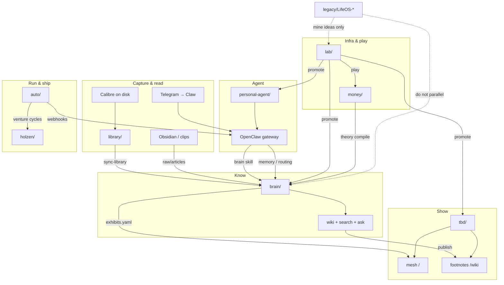

# projects

**This repo** is the thin meta-map for Angel's sibling workspace — vision, diagrams, `LEGACY.md`. It does **not** contain sibling code; clone those separately → [docs/CLONE-ALL.md](docs/CLONE-ALL.md).

A sibling workspace of eight repos — **know**, **show**, **ship**, **run**, **read**, **play**, **money**, and **agent**.

They share a parent folder but stay sovereign: no monorepo, no shared package. Cross-links are explicit (`../brain`, `../holzen`, venture YAML pointers, optional `tbd/brain` submodule for deploy).

**Boundaries (read this first):** [brain/BOUNDARIES.md](brain/BOUNDARIES.md)  
**Stack vision (LifeOS 2.0):** [docs/VISION.md](docs/VISION.md)  
**Prior LifeOS repos (legacy):** [LEGACY.md](LEGACY.md)  
**Epistemic evolution (vision + OSS):** [lab/domains/ARCHITECTURE.md](lab/domains/ARCHITECTURE.md)  
**AI engineering plays:** [lab/docs/AI-ENGINEERING.md](lab/docs/AI-ENGINEERING.md)  
**Agent orchestration:** [lab/docs/AGENT-ORCHESTRATION.md](lab/docs/AGENT-ORCHESTRATION.md)  
**Full stack clone matrix:** [lab/docs/CLONE-MATRIX.md](lab/docs/CLONE-MATRIX.md)

## Vision — LifeOS ideas, split correctly

An earlier line of work (**LifeOS**) tried to be personal AI + life memory + living UI in one app. That fought **brain** (two sources of truth). The pivot:

| Old LifeOS hunger | Owner today |
|-------------------|-------------|
| Always-on personal AI (Premium) | [**personal-agent/**](personal-agent/README.md) — OpenClaw (Claw) on Telegram / channels |
| Life memory & knowledge | [**brain/**](brain/README.md) — md-first wiki, search, compile |
| Living / felt dashboard | [**tbd/**](tbd/README.md) — exhibition mesh + footnotes |
| Integrations (Obsidian, Spotify…) | **Skills** on Claw, **jobs** in auto, **experiments** in lab — not a second PluginManager |
| Structured `life://` events | Optional bridge → `brain/raw/` or Claw `memory/` — not LifeOS Core SQLite |

**Compose OSS, own the glue.** lab proves; siblings keep what ships. See [LEGACY.md](LEGACY.md) for what not to revive as a parallel app.

**Creative loop:** raw capture (Telegram, Obsidian, library) → **brain** (what’s true enough to keep) → **tbd mesh** (how it *feels*) → **Claw** routes attention between them.

## The repos

| Repo | Concern | One line |
|------|---------|----------|
| [**brain/**](brain/README.md) | Epistemic | What you know — md-first ingest, OKF wiki, Q&A, footnotes |
| [**library/**](library/README.md) | Read | Where books live — Calibre, OPDS, sync stubs → brain |
| [**money/**](money/README.md) | Money | What you run — node compose, vendor pins, runbooks |
| [**tbd/**](tbd/README.md) | Exhibition | How you show it — mesh at `/`, footnotes at `/wiki` |
| [**holzen/**](holzen/README.md) | Product | What you ship — investor pause app (`holzen.app`), users, billing |
| [**auto/**](auto/README.md) | Operational | How work gets done — governed jobs, gates, dispatch |
| [**lab/**](lab/README.md) | Playground | OSS trials — play, adapt, promote into siblings |
| [**personal-agent/**](personal-agent/README.md) | Agent | OpenClaw workspace + VPS deploy — always-on assistant (Claw) |

### Legacy (prior work — not active)

| Repo | Status | One line |
|------|--------|----------|
| [**LifeOS-Protocol/**](legacy/LifeOS-Protocol/README.md) | archived | `LifeEvent` schema, `life://` URIs — superseded by brain for knowledge |
| [**LifeOS-Core/**](legacy/LifeOS-Core/README.md) | archived | Self-hosted life timeline — don't run parallel with brain |
| [**LifeOS-plugin-sdk/**](legacy/LifeOS-plugin-sdk/README.md) | archived | Plugin SDK (Spotify, Obsidian) — mine patterns via lab if needed |
| [**LifeOS-Premium/**](legacy/LifeOS-Premium/README.md) | archived | Hosted AI orchestration SaaS — personal agent vision → OpenClaw now |

→ Full overlap analysis: [LEGACY.md](LEGACY.md) · [legacy/README.md](legacy/README.md)

## How they connect



**ASCII detail** (data paths):

```
  Calibre (C:\Users\angel\Calibre Library)
         │  OPDS / Content server
         ▼
  library/  ──sync-library──►  brain/raw/books/*.md
         │
  clip / Obsidian Git ─────────►  brain/raw/articles/*.md
         │ compile (LLM or CI)
         ▼
  brain/wiki/  ──publish──►  brain/site/  ──tbd build──►  /wiki  (footnotes)
         │
         ├── exhibits.yaml ──sync──►  tbd mesh rooms  (felt scenes at /)
         │                              ▲
         │                              │ open-moment (one-off scenes)
         └── search / ask ◄── brain skill ── personal-agent/ (Claw)
                                    ▲
  Telegram / channels ── OpenClaw gateway ──┘
  auto ──webhook /hooks/agent──►     │
         │                           │
         ├── dispatch ──► holzen/    └── memory/, cron, morning brief
         └── plugins/runtimes/ (Cursor, Claude, OpenClaw, …)

  money/  ── compose, regtest, runbooks (vendor pins — not brain prose)
         └── theory notes ──compile──► brain/wiki/

  lab/play + lab/adapt  ──promote──►  brain | library | tbd | holzen | auto | personal-agent
         └── openclaw/, bitcoin-core/, …  (read clones; don't deploy from lab)

  legacy/LifeOS-*  ──X──►  do NOT run parallel with brain
         └── see LEGACY.md — mine URI/plugin patterns via lab only
```

| Surface | Where it lives | Who sees it |
|---------|----------------|-------------|
| Private reading room | `brain` → `npm run ui` (:3920) | You |
| Library tab (OPDS) | `brain` ui + Calibre via `library/` | You |
| Footnotes preview | `brain` → `npm run preview` (:3922) | You |
| Public wiki | `tbd` → `/wiki` (from `brain npm run publish`) | World |
| Exhibition mesh | `tbd` → `/` | Visitors |
| Personal agent | Claw → Telegram; gateway :18789 | You |
| Product app | `holzen` → `holzen.app` | Users |
| Control plane | `auto` → dashboard (:3847) | You |
| Money stack (local) | `money` → Docker compose / regtest | You |
| OSS experiments | `lab/play/*` | You (disposable) |

**Layer model (auto internals):** [auto/docs/LAYERS.md](auto/docs/LAYERS.md) — Layers 0–2 (models, pipeline, runtimes) support Layer 3 (auto), which governs Layer 4 (ventures like holzen).

## Quick start

| If you want to… | Go here |
|-----------------|---------|
| Talk to your agent (Claw) | Telegram bot · or `lab/play/openclaw/scripts/resume-openclaw.ps1` |
| Clip → compile → wiki (cloud, no PC) | Push to `brain/raw/articles/` → [brain/docs/CI.md](brain/docs/CI.md) |
| Clip from phone / Obsidian | [brain/docs/OBSIDIAN-SYNC-SETUP.md](brain/docs/OBSIDIAN-SYNC-SETUP.md), [brain/docs/MOBILE-CLIP.md](brain/docs/MOBILE-CLIP.md) |
| Sync Calibre → brain book stubs | `cd brain` → `npm run sync-library` · [library/README.md](library/README.md) |
| Instant compile at your desk | `cd brain` → `npm run watch -- --no-push` |
| One-shot push after clipping | `cd brain` → `npm run push-clips` |
| Search, ask, lint wiki | `cd brain` → [brain/README.md](brain/README.md) |
| Preview public footnotes locally | `cd brain` → `npm run publish` then `npm run preview` |
| Open mesh / exhibit a concept | `cd tbd` → [tbd/README.md](tbd/README.md) |
| Run or ship the pause app | `cd holzen` → [holzen/README.md](holzen/README.md) |
| Dispatch maintainer cycles | `cd auto` → [auto/README.md](auto/README.md) |
| Try OSS before committing to a sibling | `cd lab` → [lab/README.md](lab/README.md) |
| Run local Bitcoin regtest stack | `cd money` → [money/docs/REGTEST.md](money/docs/REGTEST.md) |

### Dev servers

| Repo | Command | URL |
|------|---------|-----|
| brain (reading room) | `npm run ui` | http://127.0.0.1:3920 |
| brain (footnotes preview) | `npm run preview` | http://127.0.0.1:3922 |
| tbd (mesh) | `npm run dev` | http://localhost:3000 |
| tbd (footnotes, after publish) | `npm run brain:publish` then dev | http://localhost:3000/wiki |
| holzen | `npm run dev` | http://localhost:8080 |
| auto | `npm run dev` | http://localhost:3847 |
| OpenClaw gateway | `lab/play/openclaw/scripts/resume-openclaw.ps1` | http://127.0.0.1:18789 |

## Where does this go?

```
Unprocessed clip or export?          → brain/raw/  (md-first: raw/articles/*.md)
Compiled fact, link, or concept?     → brain/wiki/
Agent answer, slide, or figure?      → brain/outputs/  (link from wiki)
Public footnotes HTML?               → brain/site/  → tbd public/wiki/  →  /wiki
Felt scene on the mesh?              → tbd/src/  (+ brain/exhibits.yaml)
One-off moment on the map?           → tbd  open-moment skill
Share a room                         → tbd  /?room=<slug>
Daily agent log / life capture?      → personal-agent/openclaw/memory/
Agent identity & skills?             → personal-agent/openclaw/
OpenClaw runtime config & secrets?   → ~/.openclaw/  (not git)
Maintainer cycle summary?            → {venture}/.auto/
Job record, gate, or schedule?       → auto/state/
Product code, migrations, edge fns?  → holzen/
Product docs and runbooks?           → holzen/docs/
Calibre compose, OPDS, backup?       → library/
Bitcoin compose, vendor pins?        → money/
OSS trial or clone notes?            → lab/play/<name>/
LifeOS salvage (read only)?          → legacy/  → promote ideas via lab
```

## Cross-repo workflows

### Clip → wiki → footnotes (24/7)

1. Clip lands in personal Obsidian → export to `brain/raw/articles/` (or Obsidian Git push)
2. **CI** (recommended): GitHub Actions compiles wiki — [brain/docs/CI.md](brain/docs/CI.md)
3. **tbd** rebuild on Vercel: `prebuild` runs `brain:sync` + `brain:publish` → footnotes at `/wiki`
4. Optional local: `npm run watch` in brain for instant compile without waiting on CI

Setup guides: [brain/docs/OBSIDIAN-SYNC-SETUP.md](brain/docs/OBSIDIAN-SYNC-SETUP.md) · [brain/docs/OBSIDIAN-GIT-SETUP.md](brain/docs/OBSIDIAN-GIT-SETUP.md)

### brain → tbd (exhibition)

1. Add or update entry in `brain/exhibits.yaml`
2. `cd brain && npm run sync-exhibits` (or `cd tbd && npm run brain:sync`)
3. Use `open-moment` skill in tbd — transform, don't transcribe
4. Share: `/?room=<slug>` (hyphenated room label)

### tbd deploy (Vercel)

Mesh at `/` · footnotes at `/wiki` · same deployment.

1. Link **tbd** repo to Vercel
2. **brain** must exist at build time: sibling `../brain`, submodule `tbd/brain`, or `BRAIN_ROOT` env
3. `npm run build` → sync exhibits + publish footnotes + Next.js

Details: [tbd/README.md#deploy-vercel](tbd/README.md)

### auto → holzen (maintainer cycle)

1. Venture in `auto/ventures/holzen.yaml` → `../holzen`
2. `POST /api/ventures/holzen/run` or schedule via auto dashboard
3. Agent runs in holzen checkout; memory lands in `holzen/.auto/`

### auto → Claw (personal agent dispatch)

1. Hooks wired in `~/.openclaw/openclaw.json` — see `lab/play/openclaw/scripts/setup-openclaw-stack.ps1`
2. `auto/.env` holds `OPENCLAW_HOOKS_TOKEN` + gateway URL
3. Smoke test: `lab/play/openclaw/scripts/test-auto-hook.ps1`

### library → brain (books)

1. Calibre library on disk (see `library/library.yaml`)
2. `cd brain && npm run sync-library` → stubs in `brain/raw/books/`
3. Optional: `npm run compile -- --kind book`

### money → brain (theory, not compose)

1. Run stack locally: `money/compose/` (regtest first)
2. Notes and essays live in `brain/raw/notes/` → compile → wiki
3. Read upstream source in `lab/play/bitcoin-core/` — time-boxed

### lab → siblings (promotion)

```
lab/play + lab/adapt  ──promote──►  brain | library | tbd | holzen | auto | personal-agent
```

Catalog: [lab/catalog.yaml](lab/catalog.yaml). OpenClaw study clone: [lab/play/openclaw/](lab/play/openclaw/).

### brain → holzen (research context)

Agents on holzen may read `brain/wiki/` for psychology, volatility, alignment — via prompt context, not merged repos.

## brain commands (cheat sheet)

Run from `brain/`. Requires `OPENROUTER_API_KEY` in `.env` for compile/ask.

| Command | What |
|---------|------|
| `npm run pipeline` | import → compile → health |
| `npm run watch` | poll clippings → pipeline → optional push |
| `npm run push-clips` | import → commit → push → dispatch tbd |
| `npm run compile` | LLM compile uncompiled `raw/articles/*.md` |
| `npm run ask -- "…" --save` | Q&A over wiki; save to outputs |
| `npm run search -- "…" --json` | Full-text wiki search |
| `npm run publish` | footnotes → `site/` |
| `npm run sync-exhibits` | manifest → tbd |

Configure automation in `ingest.yaml` (`auto_compile`, `auto_push`, `poll_seconds`).

## Agent entry points

| Repo | Agent rules |
|------|-------------|
| brain | [brain/AGENTS.md](brain/AGENTS.md) |
| tbd | [tbd/AGENTS.md](tbd/AGENTS.md) |
| personal-agent | [personal-agent/openclaw/AGENTS.md](personal-agent/openclaw/AGENTS.md) |
| auto | [auto/docs/LAYERS.md](auto/docs/LAYERS.md), [auto/schema/README.md](auto/schema/README.md) |
| holzen | [holzen/docs/README.md](holzen/docs/README.md) |
| lab | [lab/README.md](lab/README.md), per-play `NOTES.md` |

## Layout

```
projects/                    ← this meta-repo (README, LEGACY, docs/)
├── README.md
├── LEGACY.md
├── docs/
│   ├── VISION.md            ← LifeOS 2.0 + creative loop
│   └── CLONE-ALL.md         ← fresh machine checklist
├── legacy/
│   └── README.md            ← index only; LifeOS clones gitignored locally
├── brain/                   ← sibling (ignored by meta-repo git)
├── library/
├── money/
├── lab/
├── tbd/
├── holzen/
├── auto/
└── personal-agent/
```

## Anti-patterns

- Wiki prose inside tbd TSX (loses agent maintainability)
- Storing holzen product docs in `brain/wiki` (use `holzen/docs/`)
- Using `holzen/.auto/consensus.md` as a second brain
- Registering brain as an `operate`-phase venture (research ≠ bounded maintenance)
- Expecting visitors to browse the full private wiki on tbd (use footnotes at `/wiki` for public read)
- Running LifeOS Core from `legacy/` alongside brain — see [LEGACY.md](LEGACY.md)
- Deploying OpenClaw from `lab/play/openclaw/clone/` — use global CLI + `personal-agent/`
- Storing venture ops in Claw `memory/` when it belongs in `{venture}/.auto/`

---

Each repo owns its own README. This file is the map; follow the links for depth.
