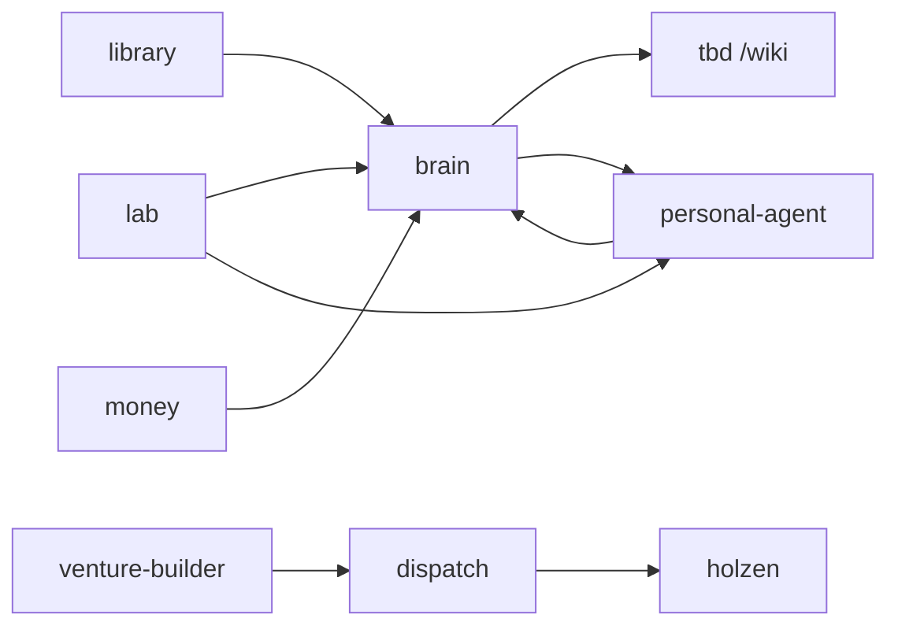

# projects

**Meta-map** for a sibling workspace of nine repos. This repo holds vision, diagrams, and clone docs — not application code. Clone siblings separately → [docs/CLONE-ALL.md](docs/CLONE-ALL.md).

**On the mesh (tbd):** `/?room=problems` · `/?room=projects` · footnotes at `/wiki`

**Thesis:** compose mature OSS; own the glue. No monorepo — explicit seams between repos.

| Doc | What |
|-----|------|
| [docs/VISION.md](docs/VISION.md) | Stack vision, creative loop |
| [docs/OSS-STRATEGY.md](docs/OSS-STRATEGY.md) | 80k × personal fit × upstream vs build |
| [brain/BOUNDARIES.md](brain/BOUNDARIES.md) | What lives where (read first) |
| [LEGACY.md](LEGACY.md) | Prior LifeOS work — mine, don't revive |

## Problems → projects

Start with **why** ([problems room](https://github.com/Angelguirao/tbd)) — then **what** (below). Not a priority ranking; each project is tagged with the problem(s) it serves.

Nearly everything is **private** today. **Holzen** is public at [holzen.app](https://holzen.app).

| Problem | Projects |
|---------|----------|
| Power-seeking AI | **bench** (`lab`) |
| Extreme power concentration | **anchor** (`money`), **bench** |
| AI-enhanced decision making | **steward**, **folio**, **codex**, **tbd**, **holzen** |

**Stack plumbing** (no macro-problem tag): **relay** (`dispatch`), **charter** (`venture-builder`).

## The stack

| Name | Folder | Role | Status | Visibility |
|------|--------|------|--------|------------|
| **folio** | `brain/` | second brain | **active** | private |
| **codex** | `library/` | reading | building | private |
| **tbd** | `tbd/` | exhibition | **active** | private |
| **steward** | `personal-agent/` | life agent | **active** | private |
| **holzen** | `holzen/` | pause ritual | **active** | [public](https://holzen.app) |
| **relay** | `dispatch/` | automation | building | private |
| **charter** | `venture-builder/` | venture rules | building | private |
| **bench** | `lab/` | experiments | **active** | private |
| **anchor** | `money/` | bitcoin | building | private |

## Archive

Not in the active stack — prior ventures kept for history.

| Name | What | When |
|------|------|------|
| **Lawers** | Litigation finance marketplace — Spain's first online litigation-funding platform | 2017–2019 · inactive |

Legacy LifeOS clones: [legacy/](legacy/README.md) — read only; see [LEGACY.md](LEGACY.md).

## How they connect



**Creative loop:** capture → **brain** (what's true enough) → **tbd** (how it feels) → **Claw** routes attention. **lab** proves; siblings keep what ships.

<details>
<summary>ASCII data paths (detail)</summary>

```
  Calibre → library/ ──sync──► brain/raw/books/
  Obsidian / clips ───────────► brain/raw/articles/
  brain/wiki/ ──publish──► tbd /wiki
  brain/exhibits.yaml ──sync──► tbd mesh rooms
  Telegram → OpenClaw → personal-agent/ ──brain skill──► brain
  venture-builder/ ──YAML──► dispatch/ ──cycles──► holzen/
  money/ compose + runbooks (vendor pins — not wiki prose)
  lab/play ──promote──► brain | tbd | personal-agent | holzen | …
```

</details>

## Quick start

| If you want to… | Go here |
|-----------------|---------|
| Open the mesh | `cd tbd && npm run dev` → http://localhost:3000 |
| Clip → compile → wiki | [brain/docs/CI.md](brain/docs/CI.md) |
| Talk to Claw | Telegram · or `lab/play/openclaw/scripts/resume-openclaw.ps1` |
| Search / ask the wiki | `cd brain` → [brain/README.md](brain/README.md) |
| Ship holzen | `cd holzen` → [holzen/README.md](holzen/README.md) |
| Try OSS before committing | `cd lab` → [lab/README.md](lab/README.md) |
| Bitcoin regtest stack | `cd money` → [money/docs/REGTEST.md](money/docs/REGTEST.md) |

### Dev servers

| Repo | Command | URL |
|------|---------|-----|
| tbd (mesh) | `npm run dev` | http://localhost:3000 |
| brain (reading room) | `npm run ui` | http://127.0.0.1:3920 |
| brain (footnotes preview) | `npm run preview` | http://127.0.0.1:3922 |
| holzen | `npm run dev` | http://localhost:8080 |
| dispatch | `npm run dev` | http://localhost:3847 |
| OpenClaw gateway | `lab/play/openclaw/scripts/resume-openclaw.ps1` | http://127.0.0.1:18789 |

## Where does this go?

```
Unprocessed clip?                 → brain/raw/
Compiled concept?                 → brain/wiki/
Public footnotes?                 → brain/site/ → tbd /wiki
Felt mesh scene?                  → tbd/src/ + brain/exhibits.yaml
Share a room                      → /?room=<slug>
Agent memory / skills?            → personal-agent/openclaw/
Venture policy?                   → venture-builder/ventures/
Product code?                     → holzen/
OSS trial?                        → lab/play/<name>/
LifeOS salvage (read only)?       → legacy/ → promote via lab
```

## Cross-repo workflows

### Clip → wiki → footnotes

1. Clip → `brain/raw/articles/` (Obsidian Git or export)
2. CI compiles — [brain/docs/CI.md](brain/docs/CI.md)
3. tbd `prebuild`: sync exhibits + publish footnotes → `/wiki`

### brain → tbd (exhibition)

1. `brain/exhibits.yaml` → `npm run sync-exhibits`
2. Mesh room in `tbd/src/` · share `/?room=<slug>`

### lab → siblings

```
lab/play ──promote──► brain | library | tbd | holzen | dispatch | personal-agent
```

Catalog: [lab/catalog.yaml](lab/catalog.yaml)

## Agent entry points

| Repo | Rules |
|------|-------|
| brain | [brain/AGENTS.md](brain/AGENTS.md) |
| tbd | [tbd/AGENTS.md](tbd/AGENTS.md) |
| personal-agent | [personal-agent/openclaw/AGENTS.md](personal-agent/openclaw/AGENTS.md) |
| dispatch | [dispatch/docs/LAYERS.md](dispatch/docs/LAYERS.md) |
| lab | [lab/README.md](lab/README.md) |

## Anti-patterns

- Wiki prose inside tbd TSX
- Running LifeOS Core alongside brain — [LEGACY.md](LEGACY.md)
- Deploying OpenClaw from `lab/play/openclaw/clone/` — use `personal-agent/`
- Storing venture ops in Claw memory when it belongs in `{venture}/.auto/`

---

Each repo owns its README. **Deep dive:** [docs/VISION.md](docs/VISION.md) · [docs/OSS-STRATEGY.md](docs/OSS-STRATEGY.md) · [docs/CLONE-ALL.md](docs/CLONE-ALL.md) · [lab/docs/CLONE-MATRIX.md](lab/docs/CLONE-MATRIX.md)
