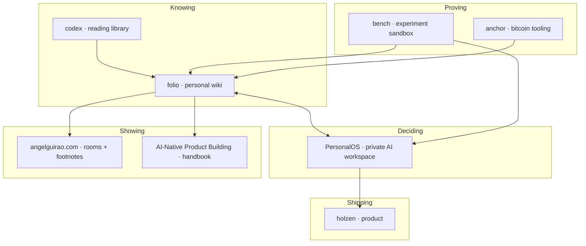

# Projects

**Angel Guirao** — I build software for thinking clearly, deciding carefully, and shipping products people can actually use.

This page is a plain map of that work. Each piece is its own repository. I prefer to reuse good open-source tools and write the connecting tissue myself.

---

## Public surfaces

These are the ones a stranger can open today:

| | |
|--|--|
| **[Holzen](https://holzen.app)** | A practice for investors: pause when markets get loud, before moving capital |
| **[AI-Native Product Building](https://ai-native-product-building.vercel.app)** | A living handbook on how AI changes product decisions |
| **[angelguirao.com](https://angelguirao.com)** | Public site — interactive rooms and short footnotes from my reading |

---

## The rest of the stack

Most of this stays private. It exists so the public work has a spine.

**Personal wiki** (*folio*) — Notes from what I read and think. Capture, search, and turn ideas into short public footnotes when they’re ready.

**Reading library** (*codex*) — Books and PDFs on my machine, linked into the wiki.

**Personal AI OS** (*PersonalOS*) — A private workspace where I chat with an assistant, run recurring jobs, and keep career, health, and venture work in one place — not a product for other people.

**Experiment sandbox** (*bench*) — A place to try open-source tools before adopting them for real.

**Bitcoin node tooling** (*anchor*) — Guides and setup for running my own Bitcoin infrastructure.

---

## How it fits together

I read → notes land in the wiki → some ideas become public footnotes or handbook chapters → products that earn users (like Holzen) get their own home. The AI OS helps me run the private side. The sandbox is where experiments live or die before they graduate.

