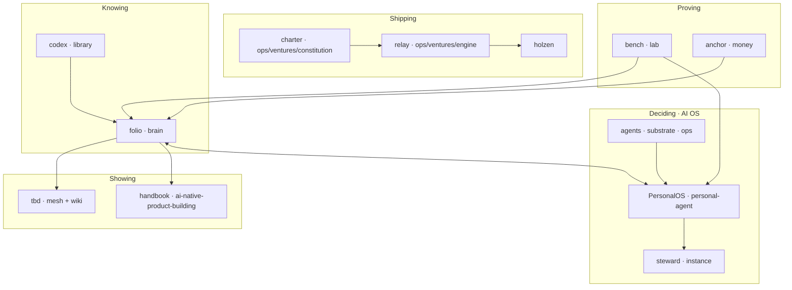

# Projects

**Angel Guirao** — product-minded full-stack engineer building tools for **knowing, deciding, and shipping** without outsourcing judgment to platforms or copilots.

This repository is the **map**: how my projects relate, what each one owns, and where to look first. Sibling repos beside this folder — not a monorepo. **Compose mature open source. Own the glue.**

---

## Start here

| Surface | What it is |
|---------|------------|
| **Mesh** (`tbd/`) | Felt rooms — problems, identity, projects, connection |
| **Footnotes** (`tbd/` `/wiki`) | Concepts from reading, distilled for strangers |
| **Holzen** (`holzen/`) | Shipped product — volatility-triggered pause before capital moves |
| **Handbook** (`ai-native-product-building/`) | Living handbook — decisions for building with AI |
| **PersonalOS** (`personal-agent/`) | Owner AI operating system — desks, steward, domain ops |

The mesh is how it *feels*. Footnotes are what I *know* in public. Holzen is what I *ship* to users. The handbook is what I *teach*. PersonalOS is how I *run* the stack.

**How code should look from the inside:** holzen’s [application architecture](holzen/docs/fundamentals/holzen-application-architecture.md) is the product reference. Stack constitution and repo seams live in local docs (`docs/`, `brain/BOUNDARIES.md`) — not published from this repo.

---

## The through-line

I read and clip. Ideas compile into a wiki (**folio**). **PersonalOS** is my AI personal operating system — steward chat, domain desks, inquiry loops, scheduled agent work, and handoffs in one place. Selected work becomes exhibition on the mesh (**tbd**). Products that earn users get their own repo (**holzen**). Experiments start in a sandbox (**bench**) and graduate or die. Open source gets composed; the seams between repos are mine.



**Reading in** → **folio** holds what's true enough → **PersonalOS** runs the AI stack (steward, desks, loops, specialists) → **tbd** exhibits what earns visibility → **holzen** (and future ventures) ship to the world. **bench** tries OSS first; **relay** and **charter** connect venture work.

---

## The projects

Product names are what I call them day to day. Folder names are the local checkouts. Active siblings share this parent folder; each has its own git remote.

### Knowing

**folio** · `brain/` · *active*  
Markdown wiki for what I read and think — capture, search, compile, publish footnotes when an idea is ready to meet the world.

**codex** · `library/` · *building*  
Home for books and PDFs that feed folio — Calibre compose, config, and sync hooks into `brain/` (content stays on disk, not in the repo).

### Deciding · AI operating system

**PersonalOS** · `personal-agent/` · *active* · GitHub repo name `personal-ai-os`  
**One repo** for the AI personal operating system — product, agents, substrate, domain ops, and LifeOS instance data.

| Path inside `personal-agent/` | Role |
|-------------------------------|------|
| `personalos/` | OS product — desks, steward chat, loops, crons |
| `agents/` | Agent specs, adapters, implementations |
| `substrate/` | Portable rules — routing, memory tiers |
| `contracts/` | Handoff JSON schemas |
| `ops/career/` | Career-scout engine — scan, score, PDF, export |
| `ops/body/` | Glucose-manager engine — TIR, Nightscout, export |
| `ops/ventures/constitution/` | Venture charter — gates, templates, registry |
| `ops/ventures/engine/` | Venture dispatch — runs, webhooks, cycles |
| `instance/` | LifeOS instance — telos, memory, skills, handoffs |
| `trigger/` | Trigger.dev scheduled tasks |
| `deploy/` | Deploy and environment docs |

**steward** · `agents/specs/steward/` · runtime in PersonalOS  
The conversational agent inside the OS — inquiry, capture, synthesis.

**LifeOS** = PersonalOS (`personal-agent/`) + **folio** (`brain/`). Holzen uses patterns from the substrate, not the private folio.

### Showing

**tbd** · `tbd/` · *active*  
Public exhibition — mesh rooms and footnotes only. Owner OS routes (`/os`, `/wiki/inner`) redirect to PersonalOS when configured.

**AI-Native Product Building** · `ai-native-product-building/` · *active*  
Living handbook — decision frameworks for building products when AI changes every step. Chapters in MDX; drafts start in brain.

### Shipping

**holzen** · `holzen/` · *active*  
Volatility-triggered pause practice for investors — rituals, AI companions, archive, and billing. Product app (`src/`) plus marketing site (`apps/site/`).

Venture **charter** and **relay** live in `personal-agent/ops/ventures/`.

### Proving

**bench** · `lab/` · *active*  
Sandbox for open source — clone under `play/`, adapt under `adapt/`, record verdicts in `catalog.yaml`, then graduate or die.

**anchor** · `money/` · *building*  
Self-custody Bitcoin infrastructure — compose, regtest, and runbooks for running my own node.

### Legacy (not active)

Prior LifeOS repos live under `legacy/` — Protocol, Core, plugin-sdk, Premium. History and mining only; see [LEGACY.md](LEGACY.md). Do not run Core beside folio.

---

## Workspace layout

```
projects/                    ← this meta-repo (public map: README only on GitHub)
├── README.md
├── LEGACY.md
├── docs/                    ← local constitution (not published with the map)
├── brain/                   ← folio
├── library/                 ← codex
├── money/                   ← anchor
├── lab/                     ← bench
├── tbd/                     ← mesh + footnotes
├── holzen/                  ← shipped product
├── ai-native-product-building/
├── personal-agent/          ← PersonalOS (remote: personal-ai-os)
└── legacy/                  ← LifeOS-* (optional)
```

Fresh machine clones: [docs/CLONE-ALL.md](docs/CLONE-ALL.md).
