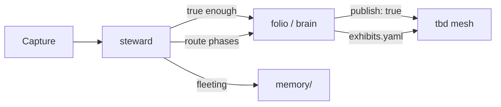

# Inquiry loop — public summary

How **folio**, **steward**, and **tbd** split knowing, routing, and exhibition. Full folio lives in [`brain/wiki/self/inquiry/`](https://github.com/Angelguirao/brain/tree/master/wiki/self/inquiry) (private repo); steward skills live in [`personal-agent`](https://github.com/Angelguirao/personal-agent) (private repo).

See also: [VISION.md](./VISION.md) (creative loop) · [BOUNDARIES.md](https://github.com/Angelguirao/brain/blob/master/BOUNDARIES.md) (repo seams)

---

## One loop

**Wonder → Propose → Critique → Build → Observe → Revise**

| Phase | Question | Steward skill (operator) |
|-------|----------|--------------------------|
| Wonder | What am I genuinely curious about? | `wonder` |
| Propose | What bet am I willing to make? | `propose` |
| Critique | What would falsify this? | `critique` |
| Build | What's the smallest run? | `build` (+ code / distill / ritual / venture / thought) |
| Observe | What happened? | `observe` |
| Revise | What do I change? | `revise` |

**pulse** (weekly cron) skims Wonder + runs Revise. **capture** feeds signals; **brain** reads folio; **telos** holds life hints — not the folio itself.

Folio is source of truth. Steward routes attention on Telegram and desk; it does not own hypothesis registries.

---

## Three layers (one schema)

| Layer | Where | Guest mesh | Owner inner path |
|-------|-------|------------|------------------|
| **Stack / code** | `stack-repos.md` in folio | Repo map, problem links, live/private badges | Same + private overlays |
| **Public inquiry** | folio entries with `publish: true` | Problems, questions, projects rooms | Same |
| **Inner life** | folio with `publish: false` | Hidden | Marriage, health, closure — inner badge only |

`publish: false` = not on the guest mesh. **Not** the same as a private GitHub repo.

---

## Creative loop vs inquiry loop

- **Creative loop:** raw signal → folio → exhibition → steward routes.
- **Inquiry loop:** structured error correction inside folio — questions sharpen into bets, bets into experiments, experiments into revised bets.

---

## Promotion workflow

1. Write in folio first (`publish: false`).
2. Stress-test — hypotheses, signals, consent.
3. Set `publish: true` when it earns public surface.
4. `npm run brain:sync` (tbd) + `npm run brain:publish` as needed.
5. Mesh picks up public entries from generated JSON — **do not** duplicate edits in tbd source files.

Footnotes (`/wiki`) ship any wiki page with `publish: true`, including under `self/`.

---

## Rules (for collaborators)

1. Edit folio, not tbd `inquiry-loop.ts` or `content.ts`, for public hypotheses and living questions.
2. Questions stay open until one sharpens into a bet.
3. **Problems** hold hypotheses; **projects** hold experiments — don't duplicate bets on projects.
4. Private stays private until you flip `publish: true`.
5. Exhibition stays handcrafted — Claw does not auto-build mesh TSX from Telegram.

**Format constitution:** [`brain/wiki/self/inquiry/constitution.md`](https://github.com/Angelguirao/brain/blob/master/wiki/self/inquiry/constitution.md) — how to write questions, bets, experiments, metrics.

---

## Surfaces

| Surface | URL | What visitors see |
|---------|-----|-------------------|
| Mesh | [angelguirao.com](https://angelguirao.com/) | Public inquiry + stack graph + felt rooms |
| Footnotes | [/wiki](https://angelguirao.com/wiki) | Published concepts only |
| Inner path | owner cookie on same site | Full folio, inner wiki, PersonalOS `/os` — not advertised |

Repo visibility on GitHub is independent. This meta-repo documents the map; sibling repos may stay private while surfaces stay live.
