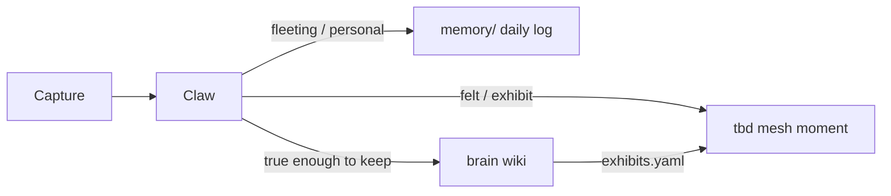

# Vision — LifeOS ideas, split correctly

This is the **why** behind the sibling stack. Implementation lives in each repo; this doc is the constitution.

See also: [README.md](../README.md) (full map), [LEGACY.md](../LEGACY.md) (what not to revive).

## The pivot

**LifeOS** tried to be personal AI + life memory + living UI in one product. That fought **brain** (two sources of truth).

The pivot is not abandonment — it is **correct ownership**:

| Hunger | Owner | Surface |
|--------|-------|---------|
| Always-on personal AI | **personal-agent** (Claw / OpenClaw) | Telegram, VPS crons |
| Agent specs (portable) | **agents** | GitHub — sync → OpenClaw workspace |
| Desk inquiry + inner folio | **personal-agent** (PersonalOS) | [os.angelguirao.com](https://os.angelguirao.com) |
| What you know | **brain** | wiki, search, compile, footnotes |
| How it feels in public | **tbd** | mesh `/`, footnotes `/wiki` — exhibition only |
| What you read | **library** | Calibre → brain stubs |
| What you ship | **holzen** | product, users, billing |
| How ventures get work | **dispatch** + **venture-builder** | gates, dispatch, webhooks |
| OSS experiments | **lab** | play → promote |
| Money infra | **money** | compose, runbooks |

Legacy LifeOS repos stay on GitHub for history and mining — see [LEGACY.md](../LEGACY.md). **LifeOS Premium**'s orchestration dashboard is archived; Claw is the personal AI successor.

## Creative loop

Raw life and thought enter from many places. Three outcomes — pick the right one:

| Signal | Route | Who builds |
|--------|-------|------------|
| "Remember this" / mood / day log | `memory/YYYY-MM-DD.md` | Claw writes |
| Concept, article, clip worth keeping | `brain/raw/` → compile | Claw or Angel → brain pipeline |
| Phenomenological / one-off scene | tbd **open-moment** | Angel + Cursor in tbd repo |
| Durable concept worth a room | `brain/exhibits.yaml` → mesh room | Angel in tbd |

**Claw routes; Claw does not auto-build mesh TSX from Telegram.** Exhibition stays handcrafted and precious.

## Compose OSS, own the glue

- **OpenClaw** = product for personal agent (npm global + your workspace)
- **lab/play/openclaw** = textbook clone, scripts, notes — not what you deploy
- **Skills** = glue (`brain`, `capture`) — markdown wrappers over sibling repos
- **Hooks** = dispatch → Claw without Telegram

## Anti-patterns

- Running LifeOS Core + brain in parallel
- Pasting wiki prose into tbd TSX
- Expecting Claw to replace open-moment craftsmanship
- Storing holzen venture memory in Claw `MEMORY.md`
- Reviving LifeOS Premium to get a personal assistant (use Claw)

## Decision log

| Date | Decision |
|------|----------|
| 2026-06-21 | LifeOS → legacy; brain + OpenClaw pivot |
| 2026-06-22 | Meta-repo `Angelguirao/projects`; Telegram daily driver |
| 2026-06-22 | LifeOS Premium indexed; personal AI = personal-agent |
| 2026-07-10 | PersonalOS on `os.angelguirao.com`; tbd exhibition-only; **agents** repo for portable specs |
